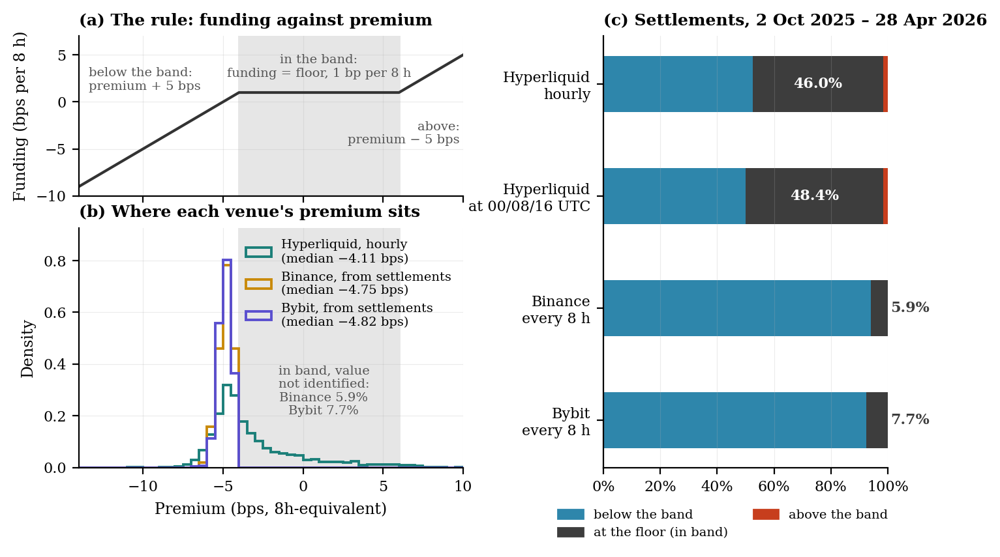

# HMM in Decentralised Perpetual Futures

Replication package for the working paper

> **Same Formula, Different Signal: Funding-Rate Censoring and Regime Dynamics
> in Decentralised Perpetual Futures**
> Gregor Albiez, School of Business, FHNW Basel.

Working paper, October 2026 (SSRN link to follow) · PDF:
[`paper/paper.pdf`](paper/paper.pdf) · LaTeX source: [`paper/paper.tex`](paper/paper.tex)



*Figure 2 of the paper: (a) the funding rule, flat on the interest floor while the
premium lies inside the band; (b) where each venue's premium sits against that
band; (c) the share of settlements below the band, exactly at the floor and
above it.*

> Hyperliquid, Binance and Bybit set perpetual funding by the same rule, which
> pays exactly an interest floor of 0.01% per eight hours whenever the premium
> lies inside a 10 bp band. Over 2 October 2025 to 28 April 2026 the same
> formula sends different signals: 46.0% of Hyperliquid's 5,001 hourly
> settlements sit exactly on the floor, and 48.4% at the exchanges' settlement
> hours, against 5.9% on Binance and 7.7% on Bybit. The cause is where the
> premiums sit — the exchanges' just below the band, Hyperliquid's across its
> lower edge with a long tail into it — and the gap persists over the five
> months that follow, 51.7% against 10.9% and 7.9%. Hyperliquid's headline rate
> is censored about half the time; its premium, not its rate, carries the signal.
>
> Fitted to that premium, a two-state Markov-switching AR(1) reverts in 36 hours
> when calm and 3.2 under stress, a ratio of 11 with a 95% interval of [3, 19].
> One hour carries its significance. Replacing the crash hour of 10 October 2025
> with the next largest observation leaves 3.0 on an interval covering unity,
> only one of fourteen rolling windows lies significantly above unity, and the
> five months after the sample reverse the ordering, at 0.23, its 95% interval ending at 0.49. The
> premium likelihood also has a dominant basin that is not its maximum: 24 of 40
> estimations settle there and report a ratio of 25. On returns, a three-state
> Gaussian HMM separates hourly volatility into 14.6%, 33.3% and 88.4%
> annualised states, and the estimated probability of a direct exit from the high
> state to the low is zero, with a 95% bound of 0.3% per hour.
> All results are descriptive.

**The comparison.** `censoring.py` counts, per venue and window, the funding
settlements exactly at the floor, from the venues' own decimal prints, and
`fetch_cex.py` retrieves the Binance and Bybit histories.

**The two models.** A **Gaussian HMM (K=3)** on hourly log-returns, estimated
with a self-contained log-space Forward–Backward / Baum–Welch implementation, and
a **Markov-switching AR(1)** on the funding premium, via `statsmodels`.

**The code**, in `src/regime_engine/`: `censoring.py` and `fetch_cex.py` (the
cross-venue comparison), `hmm.py` (Gaussian HMM and the MS-AR
multi-start), `msar.py` (MS-AR inference and half-lives), `analysis.py`
(pipeline, figures, tables), `diagnostics.py` (bootstrap, residual tests,
benchmarks), `robustness.py` (winsorisation, K = 2 … 5), `oos.py` (rolling
windows, single-observation sensitivity), `fetch_official.py` and
`fetch_prices.py` (data retrieval and checks), `funding.py` (the clamp
arithmetic), `panel.py` (alignment without look-ahead), `paper_figures.py`
(the explanatory figures, each from a tested data function).

---

## Read this before you re-run anything

### 1. The series replicate differently, and one of them only partly

| Series | Status |
|---|---|
| **Funding rate and premium** | **Fully replicable.** `fundingHistory` has no retention limit: it is free, unauthenticated, serves BTC back to June 2023, and returns the whole estimation window on demand. The series ships here (`data/interim/premium_BTC_full.csv`, 8,737 contiguous hours) *and* can be re-fetched. Re-fetched on 19 Aug 2026 it agreed with the archived panel **bit-for-bit on all 3,507 overlapping hours**. |
| **Prices** | **Partly replicable.** `candleSnapshot` serves only the most recent ~5,000 candles **per sampling interval**, so its reach is `5000 × interval`: about 208 days at **1h**, which is why the paper's 2 Oct – 2 Dec 2025 segment is gone at hourly frequency; about 417 days at **2h**, which covers the sample in full until 22 November 2026, and about 833 days at **4h**, which covers it until January 2028. The candles are built from traded prices, not from the mark price. |
| **Binance and Bybit funding and premium** | **Fully replicable.** Public, unauthenticated endpoints. Shipped in `data/interim/` (per venue, 1,096 eight-hourly settlements and 8,761 hourly premium-index readings, both stamped from 1 Oct 2025 00:00 to 1 Oct 2026 00:00 UTC; a reading is stamped when its hour opens) and re-fetchable with `python3 -m regime_engine.fetch_cex`; later fetches return a longer history. |

So every funding-side number in the paper reproduces from source, by anyone with
an internet connection and no account. The **hourly** return panel for Oct–Nov
2025 does not. What ships for the return side is
`data/processed/panel_BTC_subsample.csv` — 3,507 hourly rows, 3 Dec 2025 to
28 Apr 2026 — plus two-hourly candles covering the whole window, which match the
hourly panel aggregated to two hours on all 1,753 overlapping bars. Table 1's
log-return and closing-price rows, Tables 3 and 4 and Figure 3 rest on the original
28 April 2026 extract and are **not** re-derivable at hourly frequency. Everything else is (see the map
below). Tables 3 and 4 report the full sample; Tables A1–A3 and Figures 4 and 5
use the sub-period.

`output/summary_FULLSAMPLE_2025-10-02_to_2026-04-28.json` preserves the
original full-sample fitted parameters verbatim. It is the only surviving
record of the T = 5,001 hourly fit and is never regenerated. Two things to know
before reading it. Its arrays are ordered by **mu ascending**, the labelling
this package used at the time, so index 0 is the high-volatility state — the
opposite end from every artifact written since. And its `funding_MSAR` block is
the **superseded** MS-AR optimum (logL −4828.67, half-lives 42.87 h and 1.75 h);
the estimate the paper stands behind is in `output/diagnostics.json`, under the
MS-AR block whose window is the paper window.

### 2. The MS-AR likelihood is multi-modal and its dominant optimum is not its maximum

On the paper's window the funding-premium likelihood shows two optima.
Running `regime_engine.hmm.fit_ms_ar1_multistart` at its defaults (40 starts,
seed base 20260802, `search_reps=40`) finds:

| logL | starts reaching it | half-life, calm | half-life, stressed | ratio calm/stressed |
|---|---|---|---|---|
| **−4808.53** (the maximum) | 16 / 40 | 35.55 h | 3.18 h | **11.2** |
| −4828.67 (the attractor) | 24 / 40 | 42.89 h | 1.74 h | 24.6 |

The inferior optimum is 20.14 log-likelihood points worse and is reached by
**60% of starts**; across six disjoint blocks of 40 seeds it attracts 20 to 30
of the 40 (`output/msar_seed_variation.json`). Because the half-life is a steep
transform of `phi`, that gap more than doubles the headline ratio. A single fit
converges cleanly, reports no warning, and is wrong three times in five. The
paper reports **11.2, 95% CI [3.0, 19.4]** (delta method on the full covariance
of the two autoregressive coefficients), and Section 5.3 shows that this ratio is
carried by a single observation.

- **Never trust a single-start MS-AR fit on this data.** Use
  `fit_ms_ar1_multistart` and inspect the `optima_found` diagnostic it returns.
- **`msar.fit_msar_premium` runs the multi-start protocol by default**
  (`n_starts=40`), and `regime_engine.analysis` calls it that way, so the
  shipped entry point is safe on either window. On the shipped Dec–Apr
  sub-sample no start finds a second optimum (36 of 40 starts reach logL
  −2689.90, the other four fail to converge); on the paper window it has the two optima
  above.

---

## Every table and figure, and the command that rebuilds it

Printed numbers differ from file names. Tables: `paper/tables/table10_*` prints
as Table 2, `table1_*` to `table3_*` as Tables 3 to 5, and `table5_*` to
`table9_*` as Tables A1 to A5 in the appendix. Figures: `fig5_*` prints as
Figure 1, `fig4_*` as Figure 2, `fig6_*` as Figure 3, `fig2_*` as Figure 4,
`fig1_*` as Figure 5, `fig3_*` as Figure 6, `fig9_*` as Figure 7, `fig7_*` as
Figure 8 and `fig8_*` as Figure 9. The paper `\input`s `paper/tables/` and `paper/figures/`; `output/`
holds what the code regenerates, partly for other windows. All commands run
offline from the repository root with `export PYTHONPATH=src`.

| Printed | Content | Window | Reproducible | Command | Numbers in |
|---|---|---|---|---|---|
| Table 1 | summary statistics | paper, T = 5,001 | funding and premium rows | — | `data/interim/premium_BTC_full.csv` |
| Table 2, Figure 2 | the funding rule and censoring on Hyperliquid, Binance and Bybit | paper and after | yes | `python3 -m regime_engine.censoring` | `output/censoring_comparison.json` |
| Table 3 | information criteria, K ∈ {2, 3} | paper | no | — | `output/summary_FULLSAMPLE_*.json` (K = 3 row) |
| Table 4 | K = 3 regime parameters | paper | standard errors | `make bootstrap` | `summary_FULLSAMPLE_*.json`, `output/bootstrap_hmm.json` |
| Table 5 | MS-AR funding parameters | paper | yes | `make diagnostics` | `output/diagnostics.json` |
| Table A1 | winsorisation | sub-sample, T = 3,507 | yes | `make robustness` | `output/robustness.json` |
| Table A2 | residual diagnostics | sub-sample and paper | yes | `make diagnostics` | `output/diagnostics.json` |
| Table A3 | out-of-family benchmarks | sub-sample | yes | `make benchmarks` | `output/benchmarks.json` |
| Tables A4, A5 | rolling windows, upper-tail sensitivity | premium to 30 Sep 2026 | yes | `python3 -m regime_engine.oos` | `output/oos_robustness.json` |
| Figures 1, 7, 8, 9 | windows and data, two optima, the 10 October hour, rolling windows | as labelled | yes | `python3 -m regime_engine.paper_figures` | the artifacts above, `output/msar_optima.json` |
| Figure 3 | transition geometry of the full-sample fit | paper | no: kernel reconstructed from the archived diagonal and stationary distribution, with Â31 = 0 imposed | `python3 -m regime_engine.paper_figures --only transitions` | `output/bootstrap_hmm.json` |
| Figures 4, 5 | distributions, dashboard | sub-sample | yes | `make analyse` | `output/figures/` |
| Figure 6 | funding dynamics | paper | yes | `python3 -m regime_engine.analysis --funding-figure-paper-window` | writes `output/figures/fig3_*`, as `make analyse` does for the sub-sample; the paper's copy is `paper/figures/fig3_*` |

Five further results sit in the text of Sections 3.2, 4.3 and 5.3. The MS-AR
fitted to the headline rate comes from `scripts/msar_on_rate.py`
(`output/msar_on_rate.json`); the two-hourly refit over the whole window (11.0%,
31.6%, 88.8% annualised) from `scripts/two_hourly_refit.py`
(`output/two_hourly_refit.json`); the comparison of K = 2 … 5 from
`scripts/model_selection_extended.py` (`output/model_selection_extended.json`);
the seed blocks from `scripts/msar_seed_variation.py`
(`output/msar_seed_variation.json`); and what each optimum implies from
`scripts/msar_optima.py` (`output/msar_optima.json`). `tests/test_manuscript_*`,
`tests/test_paper_figures.py` and `tests/test_side_fits.py` fail if the
printed numbers and these artifacts part company.

---

## Reproducing

Python 3.9.6 with the pinned packages; no network access, and no installation
of this repository itself. On a fresh clone the analysis and robustness steps
take a few minutes between them (the fit cache is not shipped, so the MS-AR is
refitted from forty starts); the test suite takes about five minutes, and
`make diagnostics` about four.

```bash
git clone https://github.com/gelatotrade/HMM-Decentralised-Perpetual-Futures
cd HMM-Decentralised-Perpetual-Futures
python3 -m pip install -r requirements.txt     # exact pins; skip if already satisfied
export PYTHONPATH=src                          # src layout — no install needed

python3 -m pytest tests/ -q                                    # all green
python3 -m regime_engine.fetch_official --self-test            # offline, no network
python3 -m regime_engine.fetch_prices  --self-test             # offline, no network
python3 -m regime_engine.fetch_cex     --self-test             # offline, no network
python3 -m regime_engine.censoring                             # Table 2 and Figure 2
python3 -m regime_engine.paper_figures                         # Figures 1, 3, 7, 8, 9
python3 -m regime_engine.analysis \
    --panel data/processed/panel_BTC_subsample.csv --out output/
python3 -m regime_engine.robustness \
    --panel data/processed/panel_BTC_subsample.csv --out output/
```

`make test`, `make analyse` and `make robustness` wrap the same commands.
Every command above was run on 6 Oct 2026 and exits 0.

### What those commands reproduce

Values on the shipped 3,507-hour sub-sample, byte-identical to the archived
`output/robustness.json`, and equal to `output/summary.json` on every reported
figure:

| Quantity | Value |
|---|---|
| K=3 HMM log-likelihood | 14 323.8436 |
| K=3 HMM BIC | −28 533.41 |
| ΔBIC (K=3 − K=2) | −176.59 |
| Clamp share (funding on the 0.125 bps/h floor) | 35.44% (1,243 / 3,507) |
| MS-AR half-life, calm / stressed | 7.12 h / 24.84 h |

These are **sub-sample** numbers and they are not the paper's headline figures.
The paper reports the full sample: T = 5,001, a 46.0% clamp share, and the
half-life ratio of 11.2. On the Dec–Apr sub-sample the funding asymmetry
**reverses** — the stressed regime is the more persistent one — because the
stressed premium regime is driven by the October 2025 excursion (premium max
+23.6132 bps at 2025-10-10 22:00 UTC), which the sub-sample does not contain.

### Reproducing the paper's funding-side result

This needs the full premium series, which ships in `data/interim/`. Runs in
about two minutes.

```bash
export PYTHONPATH=src
python3 - <<'PY'
import numpy as np, pandas as pd
from regime_engine.hmm import fit_ms_ar1_multistart

df = pd.read_csv("data/interim/premium_BTC_full.csv", parse_dates=["time"])
df = df[(df["time"] >= "2025-10-02") & (df["time"] <= "2026-04-28 08:00:00+00:00")]
y = df["premium"].to_numpy(float) * 1e4          # premium in bps; T = 5001

_, res, seed, diag = fit_ms_ar1_multistart(y, n_starts=40)
names = list(res.model.param_names)
p = dict(zip(names, np.asarray(res.params, float)))
phi = [p[n] for n in names if n.startswith("ar.L1")]
s2  = [p[n] for n in names if n.startswith("sigma2")]
calm, stressed = np.argsort(s2)                  # calm = low variance
hl = lambda k: np.log(0.5) / np.log(abs(phi[k]))
print(f"logL {res.llf:.2f}   calm {hl(calm):.2f} h   stressed {hl(stressed):.2f} h"
      f"   ratio {hl(calm)/hl(stressed):.2f}")
PY
```

Expected output:

```
[MS-AR] multi-start: 2 distinct optima over 40 starts (0 failures)
         logL     -4828.67  x 24
         logL     -4808.53  x 16  <-- reported (max)
[MS-AR] WARNING: the most frequent optimum is NOT the maximum. ...
logL -4808.53   calm 35.55 h   stressed 3.18 h   ratio 11.19
```

---

## Data sources

Everything comes from Hyperliquid's public info endpoint
(`POST https://api.hyperliquid.xyz/info`), free and without an account. Series
align on an hourly UTC grid: candles and funding are inner-joined on the hour,
funding is never forward-filled, and the return at `t` uses only the closes at
`t` and `t − 1` (`regime_engine.panel.build_hourly_panel`).

- **`fundingHistory`** — `{"type": "fundingHistory", "coin": "BTC", "startTime": ms, "endTime": ms}`
  returns `time`, `fundingRate` (hourly) and `premium` (8-hour-equivalent), at
  most 500 records per call. Re-fetch to a scratch path, never over the shipped
  file, and compare:

  ```bash
  python3 -m regime_engine.fetch_official --start 2025-10-02 --end 2026-10-01 \
      --out /tmp/premium_refetch.csv
  python3 -c "import pandas as pd; a = pd.read_csv('data/interim/premium_BTC_full.csv', dtype=str); \
  b = pd.read_csv('/tmp/premium_refetch.csv', dtype=str); print(a.equals(b.head(len(a))))"
  python3 -m regime_engine.fetch_official --validate     # against the archived panel
  ```

  `--end` is an inclusive day, so a fetch today returns a strict superset of the
  shipped hours, and the comparison prints `True`: every shipped row comes back
  unchanged. That is why the file is tracked in git.
- **`candleSnapshot`** — `{"type": "candleSnapshot", "req": {"coin": "BTC", "interval": "2h", "startTime": ms, "endTime": ms}}`
  returns OHLCV candles of traded prices, about 5,000 per interval:

  ```bash
  python3 -m regime_engine.fetch_prices --dry-run      # retention and deadlines
  python3 -m regime_engine.fetch_prices --source candles --interval 2h \
      --start 2025-10-02 --end 2025-12-02
  python3 -m regime_engine.fetch_prices --validate     # bit-exact against the panel
  ```

- **Binance and Bybit** — the BTCUSDT perpetuals' funding histories
  (`fapi/v1/fundingRate`; `v5/market/funding/history`) and hourly premium index
  (`fapi/v1/premiumIndexKlines`; `v5/market/premium-index-price-kline`), all
  public. Both settle at 00, 08 and 16 UTC under the same clamp-and-floor rule.
  Rates are kept as the venues' decimal strings, so "at the floor" is exact:

  ```bash
  python3 -m regime_engine.fetch_cex --start 2025-10-01 --end "2026-10-01 00:00" \
      --out /tmp/cex_refetch
  for f in /tmp/cex_refetch/*.csv; do cmp "$f" "data/interim/$(basename "$f")" && echo "same: $f"; done
  ```

  The same `--end` reproduces the shipped files byte for byte.

`data/interim/prices_BTC_1h_tardis_samples.csv` holds 48 hourly bars for
1 Nov and 1 Dec 2025, rebuilt from Tardis' free first-of-month tick samples; it
serves as a spot check only.

---

## What ships

```
paper/                                   manuscript, PDF, and the tables and figures it uses
data/processed/panel_BTC_subsample.csv   3,507 hourly rows, 3 Dec 2025 – 28 Apr 2026
                                         (time, OHLCV, fundingRate, premium, log_return)
data/processed/panel_BTC_extended.csv    the same panel continued hourly to 27 Aug 2026
data/interim/premium_BTC_full.csv        8,737 contiguous hours of funding rate +
                                         premium, stamped 2 Oct 2025 00:00 – 1 Oct 2026 00:00 UTC
data/interim/prices_BTC_2h_*.csv         two-hourly OHLCV covering the full sample
data/interim/prices_BTC_1h_tardis_samples.csv   hourly spot-check bars
data/interim/{binance,bybit}_BTCUSDT_*.csv  Binance and Bybit funding (eight-hourly) and
                                         hourly premium index, stamped 1 Oct 2025 00:00 –
                                         1 Oct 2026 00:00 UTC
output/*.json                            every fitted number behind the paper, except the
                                         full-sample K = 2 fit (Table 3)
output/summary_FULLSAMPLE_*.json         the original full-sample fit — never regenerated
output/tables/, output/figures/          what the code regenerates (not what the paper inputs)
src/regime_engine/                       the estimation code
scripts/                                 the scripts behind model_selection_extended.json,
                                         msar_seed_variation.json, msar_optima.json,
                                         msar_on_rate.json and two_hourly_refit.json
tests/                                   unit tests, ground-truth recovery, manuscript guards
```

`data/raw/` and `output/cache/` are gitignored: the first is large and
regenerable, the second is a content-addressed fit cache keyed on a SHA-256 of
the panel and of the estimator's source and hyperparameters, so neither a
changed panel nor changed code can return a stale fit.

---

## Environment, seeds, determinism

Developed and run on **CPython 3.9.6** (macOS system Python, Darwin 24.5.0,
arm64). `requirements.txt` pins the exact versions every archived number was
produced with:

```
numpy 2.0.2   scipy 1.13.1   pandas 2.3.3   statsmodels 0.14.6   matplotlib 3.9.4
```

`statsmodels` is the pin that matters. Its Markov-switching start-parameter
search has changed across 0.14.x point releases, so an MS-AR result is not
checkable without naming the version.

| Fit | Seed |
|---|---|
| Return HMM, K states | `42 + K`, 8 random restarts, 150 EM iterations |
| Robustness HMM | `45`, same restarts |
| MS-AR start search | `20260802` (`hmm.MSAR_SEED`) |
| MS-AR multi-start | seed base `20260802`, seeds `20260802 … 20260841` |
| MS-AR seed blocks | seed bases `20260802 + 40·j`, j = 0 … 5 |

The MS-AR seed seeds NumPy's **legacy global** RNG, because that is what
`statsmodels`' start-parameter search draws from; the fit saves and restores the
caller's RNG state around it. Left unseeded, the log-likelihood moves between
runs and one run raised `LinAlgError`.

Results are reproducible on the same platform. They are *not* expected to be
bit-identical across architectures — a different BLAS will differ in the last
bits — so treat the archived JSON as the macOS/arm64 reference, not as a
cross-platform hash. `ruff check src/ tests/ scripts/` is clean, and
`.github/workflows/ci.yml` runs ruff and the test suite on Linux/x86-64 as a
smoke test.

---

## Licence and citation

The **MIT License** (`LICENSE`), © 2026 Gregor Albiez, covers the replication
code and its machine-readable outputs: `src/`, `scripts/`, `tests/`, the
Makefile and CI configuration, this README, and the JSON files and LaTeX tables
under `output/`.

**The paper is not covered by that licence.** Everything under `paper/`
(`paper.tex`, `paper.pdf`, its tables and figures) and the figure files under
`output/figures/` remain © 2026 Gregor Albiez, all rights reserved, pending the
terms of wherever the paper is published. Cite it; do not redistribute it as
your own.

The data under `data/` were retrieved from the public APIs of Hyperliquid,
Binance and Bybit and are redistributed here for replication only; no claim is
made over them.

`CITATION.cff` drives GitHub's "Cite this repository" box. It cites the working
paper and will carry the SSRN link and DOI once the paper is posted.

## Contact

Gregor Albiez — `gregor.albiez@students.fhnw.ch`

## Use of AI tools

AI assistants (Claude, Anthropic) supported this project: in searching the
literature, in writing and testing code, in cross-checking results and in
drafting and editing the text. The research question, the design of the study
and the interpretation of the results are the author's; the author directed the
work, reviewed its results and takes full responsibility for the paper and this
repository.
